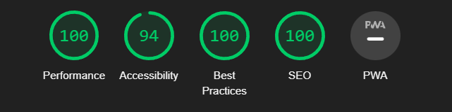
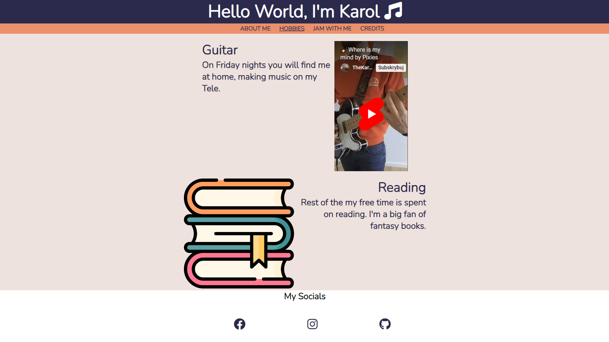
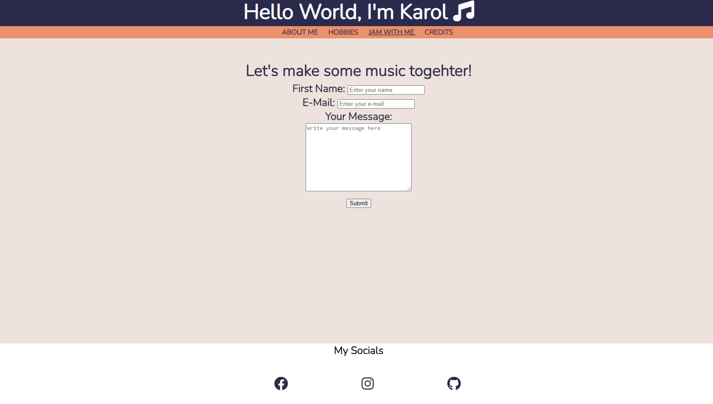
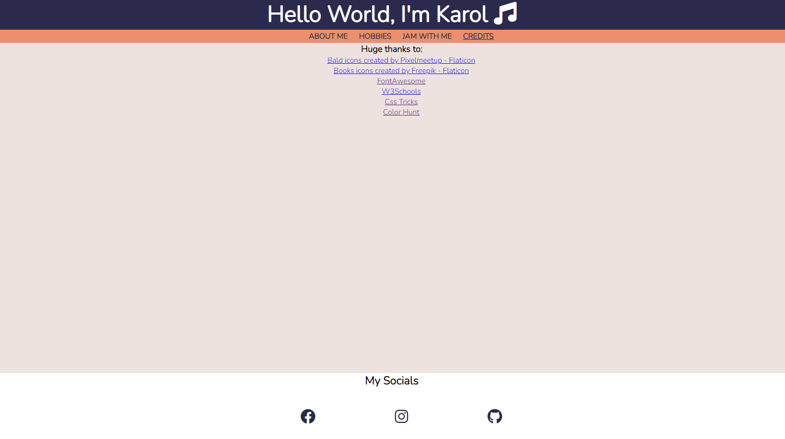

This is readmefile that I'll use to describe my website in details.

# My Personal Site!

Fully functional personal website that allows people that visit it to get to know my hobbies and connect with me.

## Table of Contents

[Description](#description)
[Features](#features)
[Usage](#usage)
[Technologies](#technologies)
[Credits](#credits)

## Description

My personal Site is a simple website build to introduce me to people that visit it and to give them the highligh of my hobbies.
It allows the musicians that I meet to quickly look at my interest and contact me if they are willing to.

The website consists of multiple pages:

⋅\*About me.

⋅\*Hobbies.

⋅\*Jam with me.

⋅\*Credits.

The whole website is using Nunito font.
The header and footer style stays the same throughout all 4 pages.

On "About me" page user the visitors can see how I look and read a short bio that describes what I do with small encouragement for jam session.

# Features

- ## About Me Page:
- Introduces the user to me and my personal site.
- Displays a graphic that looks really similar to me IRL.
- Provides short description of myself.

* ## Hobbies Page:
* Shows the visitors my passion for music, includes desctiption and a embeded YouTube Vide of me playing on gitar.
* Highlights my inetest in reading fantasy books. Includes a description and an image of books stacked on top of each other.

## Jam with Me Page:

- Encourages visitors to collaborate with me and make some music together.
- Includes a form for visitors to enter thier name, email and leave a short message to me.
